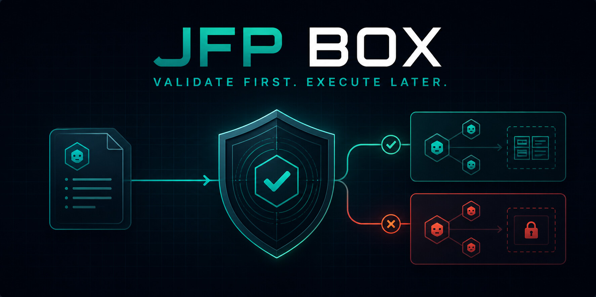
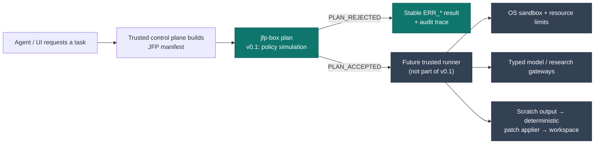

# JFP Box

**A policy gate for AI-agent tasks — validate first, execute later.**

[](https://github.com/jarohull-ai/JFP-Box/actions/workflows/rust-ci.yml)



JFP Box is a small Rust CLI and reusable library that validate a declarative
task policy before a future agent runner receives permission to start work. It
is designed for multi-agent systems where a visual workspace boundary alone is
not a security boundary.

Version `0.3.1` deliberately stops at planning. It starts no process, mounts no
filesystem, opens no connection, accesses no model, and changes no project
files. Its job is to make an unsafe or contradictory task policy fail early and
predictably.

## Why this exists

Agent platforms make it easy to create agents, tools, and workspaces. That
speed becomes risky when an agent can accidentally cross a workspace boundary,
receive untrusted web content as instructions, or request tools it should never
have had.

JFP Box separates two concerns:

1. **Policy:** a short, versioned JFP manifest declares the permitted task
   shape.
2. **Enforcement:** a future trusted runner and OS sandbox enforce an accepted
   policy. The agent never supplies host paths, secrets, ports, sandbox flags,
   or elevated capabilities.

The current validator is the policy gate. It is intentionally useful before a
live runner exists.

## How it works



The green nodes exist in v0.1. The dark nodes are deliberately separate future
components: an accepted policy must still be enforced by a trusted runner and
operating-system sandbox.

## What v0.1 validates

- Default-deny direct networking: `DIRECT_NETWORK:DENY` is mandatory.
- Explicit network modes: `OFFLINE_STRICT`, `MODEL_ONLY`, `RESEARCH`, and
  `NETWORK_RESTRICTED`.
- Registered gateways and typed tool bindings only; no raw HTTP or shell tool
  is implied by a manifest.
- `UNTRUSTED` evidence classification for research content.
- `PATCH_ONLY` output intent: a future Box writes to scratch, while a separate
  deterministic component may apply approved changes to a workspace.
- Resource and evidence bounds for model and research profiles.
- Stable `ERR_*` results, exact-byte manifest hashes, and audit trace IDs.

Full protocol details live in [SPECIFICATION.md](SPECIFICATION.md).

## What it is not

JFP Box v0.1 is **not** a Docker/Podman replacement, a kernel sandbox, a
network proxy, an agent framework, or a working gateway. It provides policy
validation, not physical containment. A `PLAN_ACCEPTED` result is a necessary
gate for a future runner; it is never proof that isolation is present.

That distinction matters: containers and OS sandboxing restrict processes;
JFP Box defines and audits the policy those systems must enforce for an agent
task.

## Where it fits

JFP Box can sit in front of a future runner used by systems such as AionUi,
VIPER AIOS, OpenClaw, or a custom multi-agent control plane. It is most useful
where task-level intent must remain portable while the runtime backend changes.

Typical uses include:

- Separating project/workspace policies before an agent task is spawned.
- Controlled OSINT: a research task collects only `UNTRUSTED` evidence through
  a future gateway, then a separate offline analysis task consumes it.
- Blocking malformed requests before they reach a model gateway, tool proxy, or
  sandbox backend.
- Providing a stable JSON contract to a UI, scheduler, audit store, or
  enterprise approval workflow.

## Quick start

Prerequisite: a current Rust toolchain with Cargo.

```bash
cd ~/Desktop/"JFP BOX"
cargo run -- --version
cargo run -- plan examples/research.jfp
```

For automation, use the stable JSON output:

```bash
cargo run -- plan --format json examples/research.jfp
```

Example result:

```json
{
  "validator_version": "0.3.1",
  "manifest_spec_version": "0.1",
  "plan_status": "PLAN_ACCEPTED",
  "errors": [],
  "audit_trace_id": "8f85f02a-0f3a-4b8e-9f93-8cc8d5cf8b3a",
  "manifest_sha256": "…",
  "generated_at": "2026-09-02T08:20:00Z"
}
```

Exit codes are stable:

| Code | Meaning |
| --- | --- |
| `0` | `PLAN_ACCEPTED` |
| `1` | `PLAN_REJECTED`, including invalid manifest syntax or encoding |
| `2` | CLI, file I/O, or internal tool error |

Run the policy suite:

```bash
cargo test
```

Build the API documentation and run repeatable local benchmarks:

```bash
RUSTDOCFLAGS="-D warnings" cargo doc --no-deps
cargo bench --bench policy
```

Benchmark figures are hardware-specific. They provide a local baseline for
regression tracking; they are not a throughput guarantee.

## Library integration

The reusable policy core lives in `src/lib.rs`; the CLI is intentionally a thin
adapter around it. A future runner can call the same parser and validator
without parsing terminal text:

```rust
use jfp_box::{parse_manifest, validate};

let manifest = parse_manifest(manifest_text).expect("manifest syntax must be valid");
let violations = validate(&manifest);
if violations.is_empty() {
    // The policy is consistent. A trusted runner may now apply its own checks.
}
```

The library API is versioned with the executable and remains pre-1.0 until a
future `v1.0.0` stable API commitment. It validates policy; it does not spawn
or sandbox a process.

## Versioning and compatibility

The executable uses SemVer. `validator_version` is the full tool version;
`manifest_spec_version` is the separate manifest contract version declared by
`SPEC_VERSION`.

- `v0.1.0` freezes the first public validator and manifest contract.
- PATCH releases fix implementation defects without changing the contract.
- MINOR releases add backwards-compatible contract features.
- A future `v1.0.0` will establish the stable public API boundary.

## Security posture

Please read [SECURITY.md](SECURITY.md) before testing JFP Box with a future
runner. Do not rely on this tool alone for hostile-code containment. Report
security issues privately; do not publish exploit details in a public issue.

## Licensing and commercial use

JFP Box is **source-available, not OSI open source**. Personal and
non-commercial use is licensed under the [PolyForm Noncommercial License
1.0.0](LICENSE). Commercial, company, managed-service, and enterprise use need
a separate written licence from the copyright holder; see
[COMMERCIAL-LICENSING.md](COMMERCIAL-LICENSING.md).

## Contact

- GitHub: [@jarohull-ai](https://github.com/jarohull-ai)
- Project questions and licensing enquiries: open a GitHub Issue after the
  repository is published.
- Licensing and commercial enquiries:
  [venom.evo@protonmail.com](mailto:venom.evo@protonmail.com)

## Contributing

Contributions are welcome under the project licence. Please read
[CONTRIBUTING.md](CONTRIBUTING.md) first.
